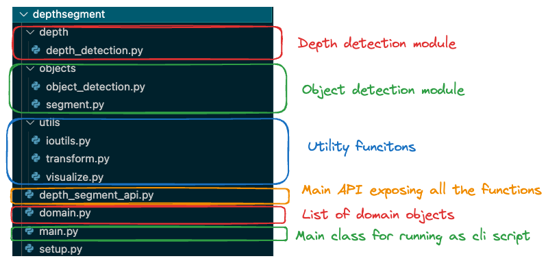
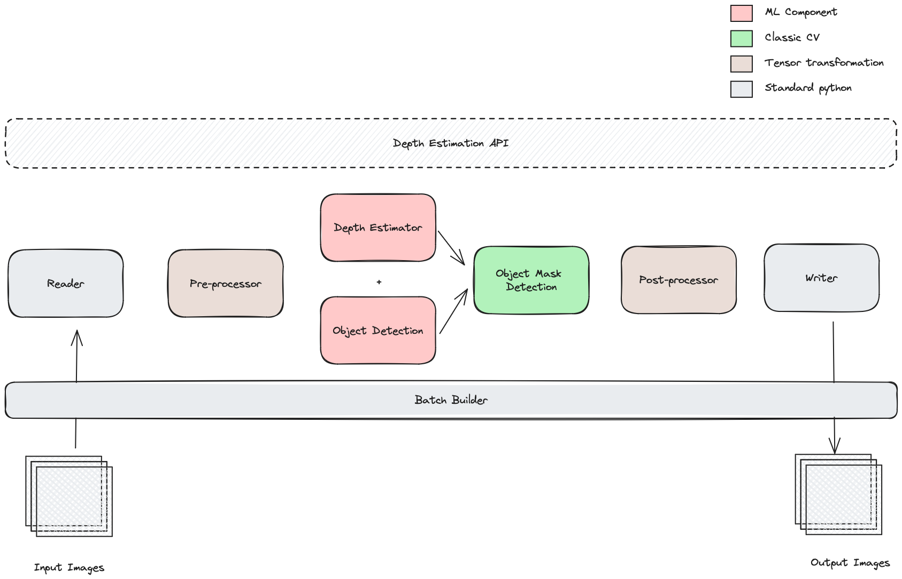

# Depth Segmentation and Object Detection

The project consists of the library depthsegment. The structure of the project is as follows :



Here are some details about the important modules :
1. `domain.py` module consists all the domain classes used in the project.
2. `object_detection.py` & `depth_detection.py` cosists of the Machine Learning code related to object detection and depth detection respectively.
3. `segment.py` module has the CV2 code related to segmented the object foreground from background.
4. `depth_segment_api.py` is the primary module which exposes all the functionality outside the module
5. `main.py` hosts the code for running as cli script (located outside the module in home directory of project)


## Tests
There are some tests present in the `tests` directory and can be run using following command :
```
pytest tests
```
**Note : Please make sure to add depthsegment module to python classpath before running tests**

## Installing as package
depthsegment can be installed as a package by using command :

```
pip install -e depthsegment
```

**Note : Please make sure to add conda env manually as shown below**

## Run the depthsegment as cli script
1. Install all the dependencties given in [envs/environment.yml](envs/environment.yml) or [envs/environment-mac.yml](envs/environment.yml) based on your OS. It can be installed using following command :
```
conda env create -n yourenvname -f envs/environment-mac.yml
```

2. Once the enviroment is ready, depthsegment can be run as cli script by running the `main.py` in conda created env as follows :
```
python depthsegment/main.py -i '/path/to/input/dir' -o '/path/to/output/dir' --obj
```

**The script accepts following aguments:**

**_Note: Script accepts images of any size, internally uses `640 X 480` to perform all operations, then resizes the images back to the original sizes._**

`-i or --input`: Path to input directory where jpeg or png RGB files are located.

`-o or --output`: Path to input directory where jpeg or png RGB files are located.

`--obj`: A flag which specifies the object detection and obj mask detection should also run. By default it is not run.

`-b or --batch`: The batch size for generating script. By default it uses a batch size of 4. Images can be provided sequentially if --batch is 1.


## How the output looks like ?
**After execution of the script, the output directory contains, following files for every image in the input directory:**

For every image.png, 

- Two depth files:
    - `image-depth.tiff`: One with actual depth values in meters    
    - `image-depth-viz.png`: Second with normalized depth values for visualziation purposes     

- Object with mask files:
    - `image-1-dog.png` and `image-2-cat.png` for a dog and cat detected in the image.
    - There would be as many mask files as there are objects detected in the image.
    (_defalut theshold used for detection is 0.9_)


## Details about the Computer Vision and Machine Learning components :
### Depth Segmentation
For depth segmentation a GPLN model from the paper [Global-Local Path Networks for Monocular Depth Estimation with Vertical CutDepth](https://arxiv.org/abs/2201.07436) is used.

The weights used are from HuggingFace for the GPLN model trained on NYU-V2 dataset.

The model takes in a `640 X 480 RGB` image and outputs `640 X 480` depth map with float outputs of depth in meters.

### Object Detection
For object detection, a Faster-RCNN is used.

The weights used are for a Faster-RCNN pretrained on COCO dataset.

The model takes in a `640 X 480 RGB` image and detects object bouding boxes for the 91 COCO classes.

### Object Segmentation
The object segmentation model uses CV2's Thresholding technique, combined with morphological operations for separating the background and the object. All the values which are higher than the threshold are classified as background and rest are classified as foreground.

The function accepts the `640 X 480` object mask, the bounding box of the object detected in the object detection model and outputs a mask of segmented object of size `640 X 480`


## Illustration of project architecture




